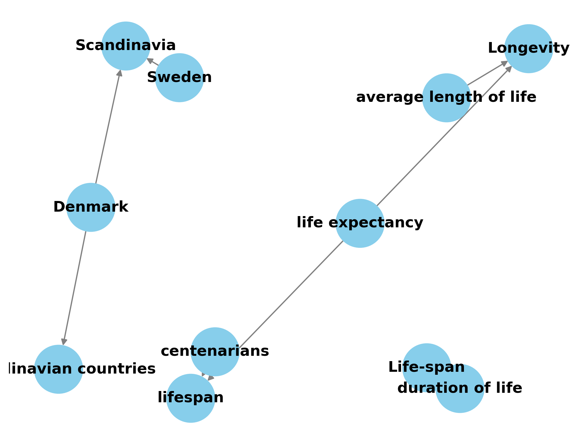

### Implementation
#### Paper: REBEL: Relation Extraction By End-to-end Language generation
Link: [here](https://aclanthology.org/2021.findings-emnlp.204/)

#### Run the Relation Extraction Pipeline
```bash
PYTHONPATH=. python main.py -c config/build_research_paper_knowledge_graph.yaml
```
##### Output knowledge graph plot
`src/output/kg_plot.png`

Example path: `/home/kushwaha/Projects/knowledge-graph-on-research-paper/src/output/kg_plot.png`

#### Pipeline
Scalable code structure to run number of experiments without loosing their config. 
**Reproduce them by making a new config to reproduce later.**
Add the steps from in the config:steps to execute them in the linear way. 

#### Config
```yaml
data:
  research_paper_path: data/text_paper/aging.yaml

output:
  output_kg_plot_path: output/kg_plot.png

steps:
  - read-research-paper
  - document-relation-extraction
  - build-knowledge-graph


````

#### Results
This KG plot is based on the first two section of the research paper.



## Other Explored Projects:

### OpenNRE: An Open-source Neural Relation Extraction toolkit
https://github.com/thunlp/OpenNRE
**Comment:** Tested the framework on our research paper. We observed poor performance on the scientific paper/excerpt.  


### PURE: PURE: Entity and Relation Extraction from Text
https://github.com/princeton-nlp/PURE
**Comment:** Very promising. 
This project has:
- **SciBERT-approx** (cross, W=100) (390M): Cross-sentence approximation relation model based on **allenai/scibert_scivocab_uncased**
- Time permitting, I would like to explore more about the performance. As of now - framework allows only to evaluate the model.


### ASP: Autoregressive Structured Prediction with Language Models
https://arxiv.org/pdf/2210.14698.pdf

**Comment:** It is a conditional language model that is based on the intra-structure dependencies.
Limited open-source to explore how it does on a sample sentence/document.

### DeepKE: A Deep Learning Based Knowledge Extraction Toolkit for Knowledge Graph Construction
https://github.com/zjunlp/DeepKE
Powerful algorithms but for relation extraction but limited access to English language pre-trained model.


#### RSMAN:Relation-Specific Attentions over Entity Mentions for Enhanced Document-Level Relation Extraction
Part of DeepKE: https://github.com/FDUyjx/RSMAN

#### Papers
- https://huggingface.co/datasets/docred
- https://github.com/Babelscape/rebel
